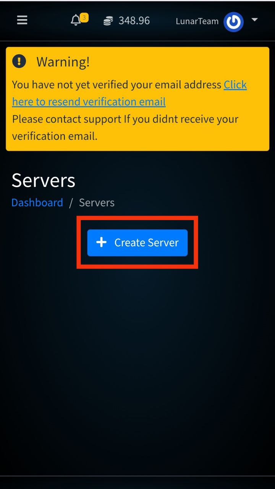
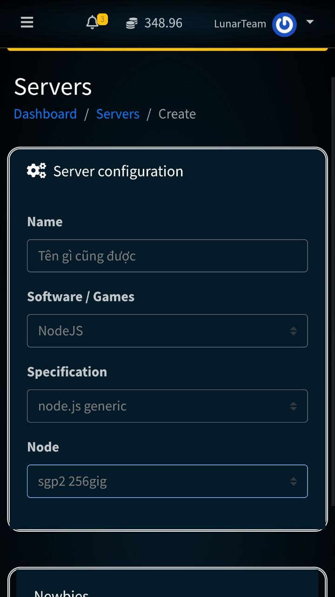
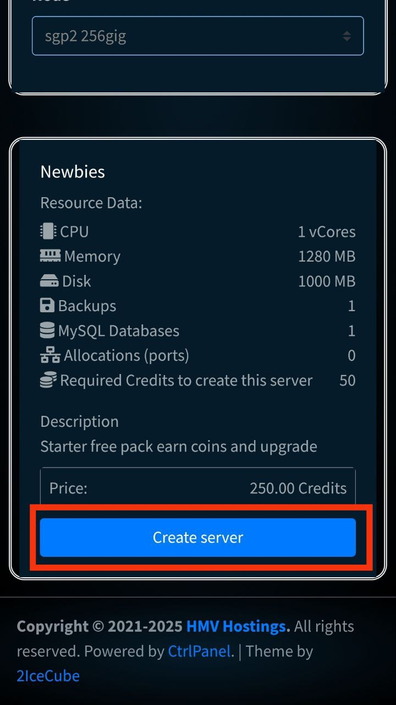
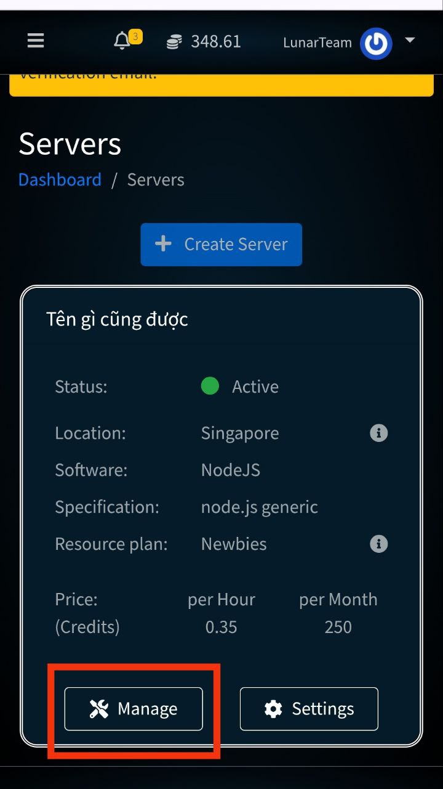

# Commands
### Tất cả các lệnh mình để ở đây
## Video: [CÁCH CHẠY BOT MESSENGER TRÊN TERMUX MỚI NHẤT 2025](https://www.youtube.com/watch?v=v5hi6KSfqn0)
### Dán cái này lúc mới vào Termux (lưu ý phải cấp quyền truy cập file cho Termux nhé)
- ```apt update && apt upgrade -y && apt install proot-distro -y && proot-distro install ubuntu && proot-distro login ubuntu```
### sau khi đã vào root@localhost#:~# 
- ```
  apt update
  apt upgrade -y
  apt-get install -y git curl sudo
  curl -fsSL https://deb.nodesource.com/setup_20.x | sudo -E bash -
  sudo apt-get install -y nodejs
  ```
### Đối với lần chạy bot tiếp theo
- ```proot-distro login ubuntu```
- Sau đó ```cd``` vào file bot của bạn và nhập ```npm start``` là được

## Video: [CÁCH TREO BOT 24/7 BẰNG HOSTING FREE | SHARE FILE PHIÊN BẢN HOSTING FREE 2025](https://www.youtube.com/watch?v=QfHTNhqFEmM)
### Link Host mình sử dụng trong video: [HMV-Hosting](https://dash.hmvhostings.com/servers)
## Các bước tạo một máy chủ (server)
- Bước 1 ấn Create Server



- Bước 2 cấu hình như hình bên dưới



- Bước 3 ấn Create server



- Bước 4 ấn Manage




## Nó sẽ đưa bạn đến trang chủ như trong video, tuy nhiên bạn cần đăng nhập và sau đó nó sẽ đưa bạn vào trong mục quản lí server
### Thông tin ở mục startup
- Lưu ý: Docker Image để 20 trở lên
#### Git Repo Address
- ```https://github.com/LunarKrystal/Lunar-Krystal```
#### Install Branch
- ```hosting```
